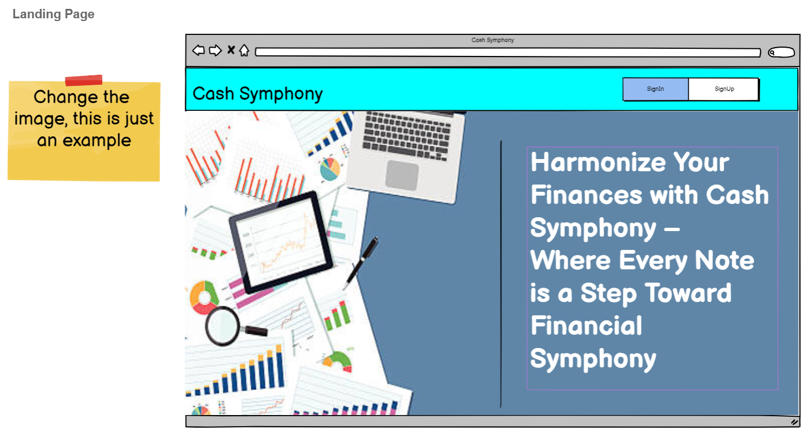
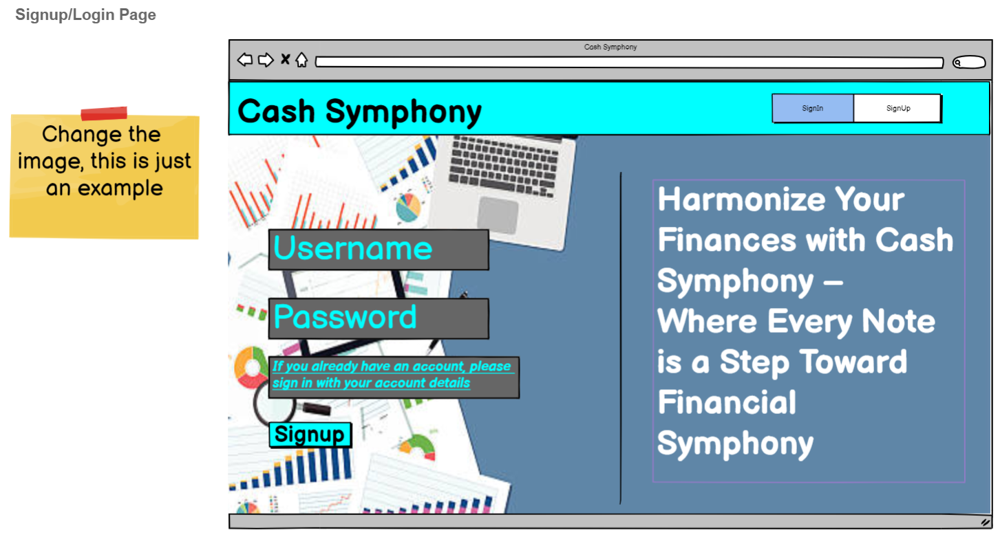
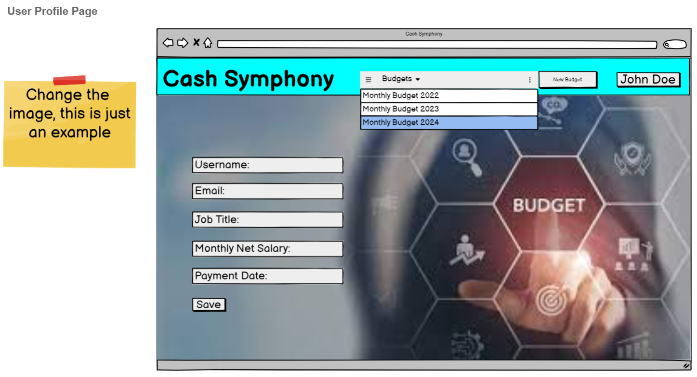

# [Cash Symphony](http://your-deployed-link.com/)

The [Cash Symphony](http://your-deployed-link.com/) is a Budget App built under the theme Budget Busters: New Year, New Numbers for the January Hackathon Project. 

Embark on a journey towards financial empowerment with our cutting-edge budget app designed to revolutionize the way you manage your finances. Whether you're a seasoned budgeting pro or just starting on your financial wellness path, Cash Symphony is here to simplify the process and elevate your money management experience. This is through the app helping you initiate your budgeting journey, record your finances, set realistic and attainable goals and also help you with valuable insights into your spending habits. In a nutshell the app will get you an analysis into your financial data to help you identify areas for improvement, empowering you to make informed decisions about your money.

Responsive Image 
(Deployed App Link](http://your-deployed-link.com/)

During our collaborative and brainstorming sessions, we recognized and valued the unique talents of each team member, aiming to select a project that would be captivating for everyone. This led us to collectively decide to build a front-end application, enabling each team member to actively engage in its development.

Using "Budget Busters: New Year, New Numbers" theme, we developed an application that enables users to enhance their expense tracking. Through forexample, a chart generated from the data that the user inputs, this allows the user to visually compare the distribution of their salary or income across various expenditures.

---

## Table of contents

- [Cash Symphony](http://your-deployed-link.com/)
  - [Table of contents](#table-of-contents)
  - [UX](#ux)
    - [User Stories](#user-stories)
      - [Goals:](#goals)
  - [Back to top](#back-to-top)
  - [Wireframes](#wireframes)
    - [Desktop](#desktop)
      - [Main Page](#main-page)
      - [Signup and Login](#signup-and-login)
      - [User Profile ](#user-profile)
      - [Budget page ](#budget-page-)
    - [Mobile](#mobile)
      - [Main Page ](#main-page--1)
      - [Signup and Login](#signup--1)
      - [User Profile ](#user-profile--1)
      - [Budget page ](#budget-page--1)
    - [Style and colours](#style-and-colours)
      - [Color Palette ](#color-palette-)
      - [Typography](#typography)
    - [Imagery](#imagery)
  - [Features](#features)
    - [Existing Features](#existing-features)
    - [Home Page](#home-page)
    - [Calculator Page](#calculator-page)
    - [Tips Page](#tips-page)
    - [About Page](#about-page)
    - [Team Page](#team-page)
    - [Future Features](#future-features)
  - [Technologies Used](#technologies-used)
  - [Languages](#languages)
  - [Testing](#testing)
  - [Deployment](#deployment)
    - [**GitHub Pages**](#github-pages)
    - [**How to deploy GitHub Pages**](#how-to-deploy-github-pages)
    - [**Cloning the repository**](#cloning-the-repository)
  - [Credits](#credits)
    - [Acknowledgements](#acknowledgements)
  - [\*Disclaimer: This Project was created for January's Hackathon. It should not be taken as actual financial advice.](#disclaimer-this-project-was-created-for-januarys-hackathon-it-should-not-be-taken-as-actual-financial-advice)

---

## UX

---

### User Stories
  #### Goals:
  - To ensure that the site  is reponsive on different screen sizes.
  - To build a website that is inclusive and accommodates all users, considering factors such as color-blindness and compatibility with screen readers.
  - To ensure customised label names on charts forexample in regard to the data input
  - To be able to compare spending/savings against income recieved
  - To have the site take into consideration of different currencies, allowing the site to be used in different countries. 

[Back to top](#Table-of-contents)
---

## Wireframes
### Desktop
#### Main Page  
  
#### Signup and Login Page  
  
#### User Profile page  
  
#### Budget page  
  
### Mobile
#### Main Page  
  
#### Signup and Login Page  
  
#### User Profile page  
  
#### Budget page  
  

---

### Style and colours
#### Color Palette  
The project's refreshed blue palette, synonymous with stability and trust, resonates seamlessly with the core theme of taking control of your finances. Embrace the calming shades for a visual journey that instills financial stability, reliability, and mastery.  
  
#### Typography
The project boasts a professional aesthetic, thanks to the well-coordinated pairing of [EB Garamond](https://fonts.google.com/specimen/EB+Garamond) and [Roboto](https://fonts.google.com/specimen/Roboto) which seamlessly complement each other.

### Imagery
[Unsplash](https://unsplash.com/s/photos/budget) Most of the images used are sourced from Unsplash and are licensed for commercial use. A couple of images were also created using Adobe Firefly AI.

[Back to top](#Table-of-contents)

---

## Features

### Existing Features

- #### Header - The header consist of the name of the project on the left and the navigation links on the right. On mobile devices the navigation turns into hamburger menu and the links to the pages appear sliding from the left. This is to guarantee better user experience on smaller devices.

- #### Hero sections - There is a hero section on the home page, the tips page and the about page. It consist of relevant to the page heading and image. The hero section on the home page has a see more button which will take the user to the about page which will provide the user with more information.

[Back to top](#Table-of-contents)

---
### Home Page
- The home page consist of image which visually represents the main idea behind this project. Presenting the information in a more visual way helps the user the understand the concept easier. This is then followed by section which goes into a bit more detail about the concept followed by a button which when clicked will take the user to the calculator page. 

[Back to top](#Table-of-contents)

---
### Calculator Page
- The calculator page has 3 sections:
  1. The 5 Bucket Calculator
      
      Users can enter their salary and click calculate to find out how much money has to go in each bucket based on Dan Lok's theory
  2. The Buckets Breakdown 
     
     Users can enter all their regular payments to track how their money is spend. Once they click calculate they will be presented with a chart of their own buckets compared to Lok's theory.
     
  3. The Currency Convertor
     

[Back to top](#Table-of-contents)

---
### Tips Page
- The Tips page consist of carefully selected and presented information for the user for better money management. On the left there is a collapsible list with 5 tips followed by image representing saving. On the right there is more information about credit card usage.

[Back to top](#Table-of-contents)

---
### About Page
- The About page was created to provide more information to the user about the Five Bucket Method. It also has a button which takes the user to the calculator page. 

[Back to top](#Table-of-contents)

---
### Team Page
- The Team page consist of information about the team who created the project and links to each member's LinkedIn and GitHub.

[Back to top](#Table-of-contents)

---
### Future Features

- #### Download Data
  - Users have the option to export and download a pdf file of their data after using the calculator.
- #### User Login
  - Users have the option to create an account where they can easily save and adjust their details.
- #### Convert Currency
  - Once the user has used the calculator their will have they option to automatically convert all figures to a different currency. As we did not have the time to add this functionality on the finished app, we decided to add a separate currency convertor bellow the calculators.

- #### Link your Banking App
  - Users have the option to link their banking app and every time they make a transaction it is automatically added to their Buckets Breakdown. This makes it easier for users to keep a track of all speedings without having to manually enter it.

[Back to top](#Table-of-contents)

---

## Technologies Used

- [GitHub](https://github.com/) - GithHub is the hosting site used to store the source code for the Website and Git Pages is used for the deployment of the live site.
- [Git](https://git-scm.com/) was used as version control software to commit and push code to the GitHub repository where the source code is stored.
- [Google Chrome Developer Tools](https://developer.chrome.com/docs/devtools/) was used as a testing tool during the development of the application. 
- [Google Fonts](https://fonts.google.com/) was used to import the fonts [Open Sans](https://fonts.google.com/specimen/Open+Sans?query=open) and [Playfair Display](https://fonts.google.com/specimen/Playfair+Display?query=playfair)
- [Font Awesome](https://fontawesome.com/) was used for icons.
- [Balsamiq Wireframes](https://balsamiq.com/wireframes/) was used to create the wireframes for the mobile version of the application.
- [Photoshop](https://www.adobe.com/ie/products/photoshop.html) was used to create the desktop mockups and resize and export the images for web. 
- [Coolors.co](https://coolors.co/) was used to display the colour palette
- [Favicon.io](https://favicon.io/) was used to create the favicon for the website.
- [Exchangerates API](https://exchangeratesapi.io/)was used for the currency converter

## Languages
- HTML - used to build the main structure of the website.
- CSS - custom written CSS was used as an addition to Materialize. 
- [Materialize Framework](https://materializecss.com/) - used throughout the website for layout and styling.
- JavaScript - was used to create functionality for the calculator.
- [Jquery](https://jquery.com/)

[Back to top](#Table-of-contents)

---

## Testing

[All testing can be found here](TESTING.md)

---
## Deployment
### **GitHub Pages**
The website is deployed using GitHub pages. It automatically updates new commits as they are pushed to the repository.

### **How to deploy GitHub Pages**
1. Login to my GitHub account
2. Open the repository
3. Click on Settings
4. Scroll down and click on the Pages tab located on the left of the screen
5. Under 'Source' select the main branch
6. Wait for the page to refresh
7. Scroll down to and locate the website link under the 'GitHub Pages' section

### **Cloning the repository**
1. Open the repository
2. Click the Code button above the list of files
3. Click on GitHub CLI and click on the 'copy' button to copy the URL link
4. Open GitPod 
5. Type 'git clone' and paste the URL link

Find more [here](https://docs.github.com/en/repositories/creating-and-managing-repositories/cloning-a-repository#cloning-a-repository-to-github-desktop)

[Back to top](#Table-of-contents)

---

## Credits
- [CSS Tricks](https://css-tricks.com/css-link-hover-effects/) was used for inspiration for the hover effect on the nav.
- [CodeVille](https://www.youtube.com/watch?v=C-qi-z8phTM&ab_channel=CodesVille) Currency Converter
- FavIcon
    - [Source](https://www.clipartmax.com/download/m2H7i8A0m2G6G6H7_money-flat-icon-ecoverauthority-logo-homepage/ )
    - [Processed at 'favicon-converter'](https://favicon.io/favicon-converter/)

### Acknowledgements
- The Hackathon Team - Big thank you for making this Hackathon happen. It was great experience. 

[Back to top](#Table-of-contents)

---

## *Disclaimer: This Project was created for January's Hackathon. It should not be taken as actual financial advice.