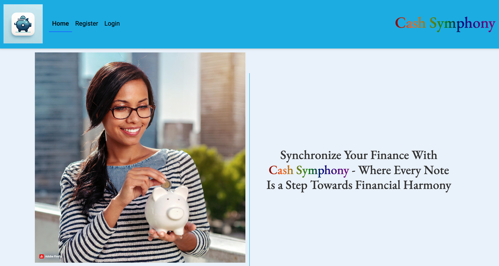
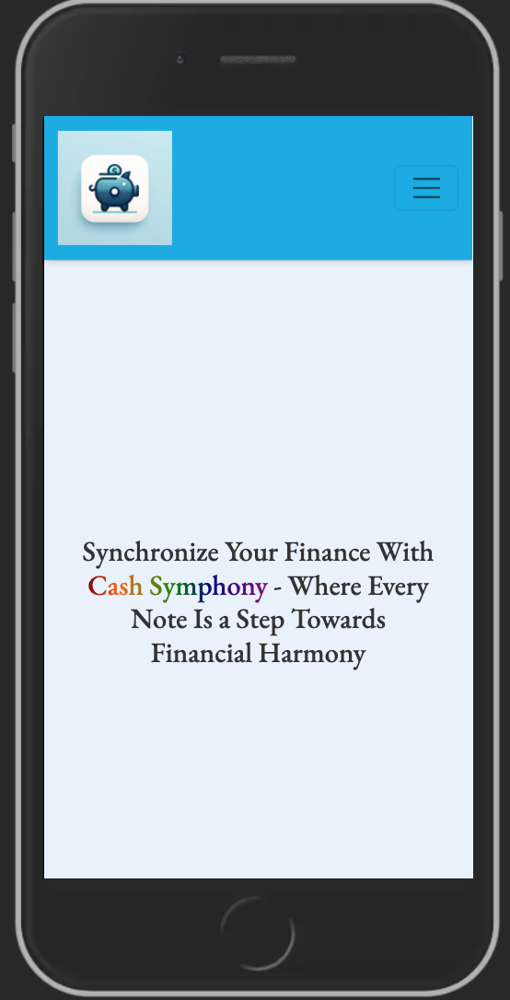
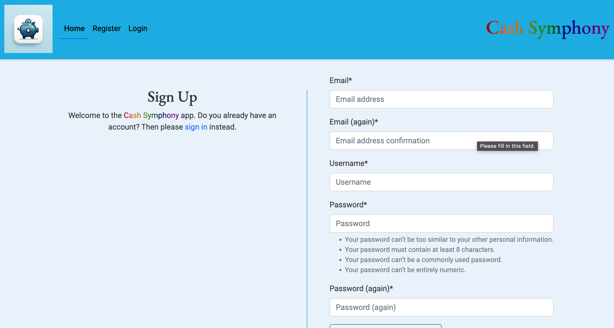
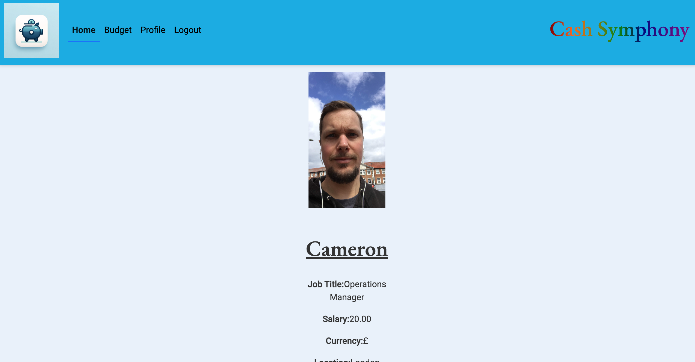
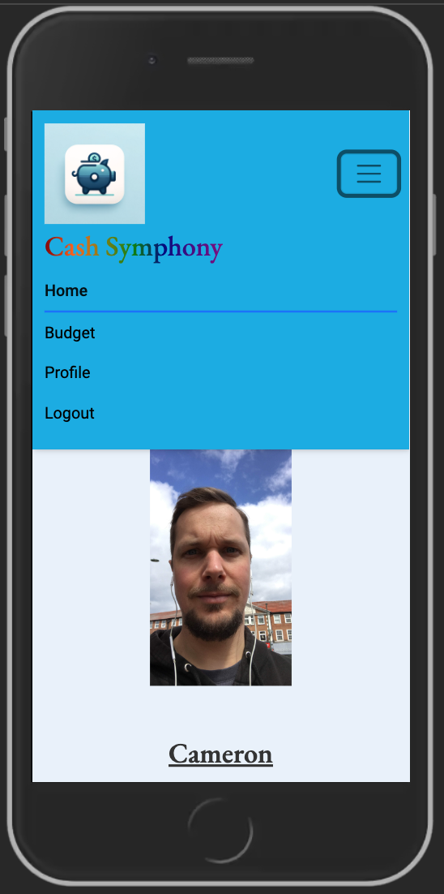
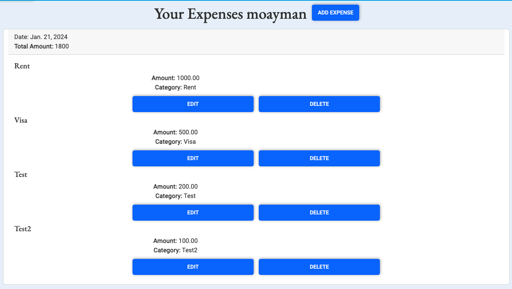

# [Cash Symphony](https://cash-symphony-0a6254cc8639.herokuapp.com/)

The [Cash Symphony](https://cash-symphony-0a6254cc8639.herokuapp.com/) is a Budget App built under the theme Budget Busters: New Year, New Numbers for the January Hackathon Project. 

Embark on a journey towards financial empowerment with our cutting-edge budget app designed to revolutionize the way you manage your finances. Whether you're a seasoned budgeting pro or just starting on your financial wellness path, Cash Symphony is here to simplify the process and elevate your money management experience. This is through the app helping you initiate your budgeting journey, record your finances, set realistic and attainable goals and also help you with valuable insights into your spending habits. In a nutshell the app will get you an analysis into your financial data to help you identify areas for improvement, empowering you to make informed decisions about your money.

Responsive Image 
(Deployed App Link](https://cash-symphony-0a6254cc8639.herokuapp.com/)

During our collaborative and brainstorming sessions, we recognized and valued the unique talents of each team member, aiming to select a project that would be captivating for everyone. This led us to collectively decide to build a front-end application, enabling each team member to actively engage in its development.

Using "Budget Busters: New Year, New Numbers" theme, we developed an application that enables users to enhance their expense tracking. Through forexample, a chart generated from the data that the user inputs, this allows the user to visually compare the distribution of their salary or income across various expenditures.

---

## Table of contents

- [Cash Symphony](https://cash-symphony-0a6254cc8639.herokuapp.com/)
  - [Table of contents](#table-of-contents)
  - [UX](#ux)
    - [User Stories](#user-stories)
      - [Goals:](#goals)
  - [Back to top](#back-to-top)
  - [Wireframes](#wireframes)
    - [Desktop](#desktop)
      - [Main Page](#main-page)
      - [Signup and Login](#signup-and-login-page)
      - [User Profile ](#user-profile-page)
      - [Budget page ](#budget-page-frame)
    - [Style and colours](#style-and-colours)
      - [Color Palette ](#color-palette-)
      - [Typography](#typography)
    - [Imagery](#imagery)
  - [Features](#features)
    - [Existing Features](#existing-features)
    - [Home Page](#home-page)
    - [Register Page](#register-page)
    - [Profile Page](#profile-page)
    - [Budget Page](#budget-page)
  - [Technologies Used](#technologies-used)
  - [Languages](#languages)
  - [Testing](#testing)
  - [Deployment](#deployment)
    - [**GitHub Pages**](#github-pages)
    - [**How to deploy GitHub Pages**](#how-to-deploy-github-pages)
    - [**Cloning the repository**](#cloning-the-repository)
  - [Credits](#credits)
    - [Acknowledgements](#acknowledgements)
  - [\*Disclaimer: This project was developed for the January Hackathon-Team9 and is not intended as genuine financial advice.](#disclaimer-this-project-was-developed-for-the-january-hackathon-team9-and-is-not-intended-as-genuine-financial-advice.)

---

## UX

---

### User Stories
  #### Goals:
  - To ensure that the site  is reponsive on different screen sizes.
  - To build a website that is inclusive and accommodates all users, considering factors such as color-blindness and compatibility with screen readers.
  - To ensure customised label names on charts forexample in regard to the data input
  - To be able to compare spending/savings against income recieved
  - To have the site take into consideration of different currencies, allowing the site to be used in different countries. 

[Back to top](#table-of-contents)
---

## Wireframes
### Desktop
#### Main Page 

#### Signup and Login Page

#### User Profile

#### Budget Page Frame

[Back to top](#table-of-contents)
---

### Style and colours
#### Color Palette  
The project's refreshed blue palette, synonymous with stability and trust, resonates seamlessly with the core theme of taking control of your finances. Embrace the calming shades for a visual journey that instills financial stability, reliability, and mastery. This palette was created using HTML and CSS  
  
#### Typography
The project boasts a professional aesthetic, thanks to the well-coordinated pairing of [EB Garamond](https://fonts.google.com/specimen/EB+Garamond) and [Roboto](https://fonts.google.com/specimen/Roboto) which seamlessly complement each other.

### Imagery
[Unsplash](https://unsplash.com/s/photos/budget) Most of the images used are sourced from Unsplash and are licensed for commercial use. A couple of images were also created using Adobe Firefly AI.

[Back to top](#table-of-contents)

---

## Features

### Existing Features

- #### Header 
- The header includes the project name on the left, and on the right, there's the logo alongside navigation links. When viewed on mobile devices, the navigation transforms into a hamburger menu, and the page links smoothly slide in from the right. This ensures an enhanced user experience on smaller screens.

- #### Hero sections 
- There are three main call-to-action buttons: "Home," "Register," and "Login," inviting users to engage with the platform.

[Back to top](#table-of-contents)

---
### Home Page
- The homepage features an image that visually encapsulates the core idea of this project. Presenting information in a visual format aids users in grasping the concept more effortlessly. The tagline and the image further emphasizes that using this tool will help users achieve financial balance and success. Overall, the design is modern, clean, and visually appealing, creating a welcoming environment for users to manage their finances.

  

[Back to top](#table-of-contents)

---
### Register Page
- The registration page on our financial website/app is your gateway to financial empowerment. Sign up to access personalized financial tools, budgeting features, and goal-setting functionalities. Safeguard your financial future by creating an account and taking the first step towards a more secure and organized financial life.

 

And below is an image for a login page designed for those who already have accounts. 

 

[Back to top](#table-of-contents)

---
### Profile Page
- The page is to display a person's details once logged in

 

[Back to top](#table-of-contents)

---
### Budget Page 
- A user-friendly hub for effortless budgeting. Easily set and manage budgets, categorize expenses, and track spending trends. Gain valuable insights through charts and graphs, making informed decisions to align budget with set goals. Optimize financial well-being conveniently on this platform.

Also in this section, a user gets to track their expenses with the ability to edit and delete certain input data. 

[Back to top](#table-of-contents)

---

## Technologies Used

- [GitHub](https://github.com/) - GithHub is the hosting site used to store the source code for the Website and Git Pages is used for the deployment of the live site.
- [Git](https://git-scm.com/) was used as version control software to commit and push code to the GitHub repository where the source code is stored.
- [Google Chrome Developer Tools](https://developer.chrome.com/docs/devtools/) was used as a testing tool during the development of the application. 
- [Google Fonts](https://fonts.google.com/) was used to import the fonts [EB Garamond](https://fonts.google.com/specimen/EB+Garamond) and [Roboto](https://fonts.google.com/specimen/Roboto)
- [Font Awesome](https://fontawesome.com/) was used for icons.
- [Balsamiq Wireframes](https://balsamiq.com/wireframes/) was used to create the wireframes for the mobile version of the application.

## Languages
- HTML - used in constructing the primary framework of the website.
- CSS - to control the visual presentation and layout of elements.
- JavaScript - to create a user interface for inputting, calculating, and displaying budget-related information.
- Python - to facilitate development of the website with Django providing the tools for database management.

[Back to top](#table-of-contents)

---

## Testing

[All testing can be found here](TESTING.md)

---
## Deployment
### **GitHub Pages**
The website is deployed using GitHub pages. It automatically updates new commits as they are pushed to the repository.

### **How to deploy GitHub Pages**
1. Login to my GitHub account
2. Open the repository
3. Click on Settings
4. Scroll down and click on the Pages tab located on the left of the screen
5. Under 'Source' select the main branch
6. Wait for the page to refresh
7. Scroll down to and locate the website link under the 'GitHub Pages' section

### **Cloning the repository**
1. Open the repository
2. Click the Code button above the list of files
3. Click on GitHub CLI and click on the 'copy' button to copy the URL link
4. Open GitPod 
5. Type 'git clone' and paste the URL link

[Back to top](#table-of-contents)

---

## Credits
- [Unsplash](https://unsplash.com/s/photos/budget) was used to source images. 
- [Adobe Firefly AI](https://www.adobe.com/products/firefly.html) to create images 
- [Favicon.io](https://favicon.io/) was used to create the favicon for the website.

### Acknowledgements
A huge appreciation to the Hackathon Team for orchestrating this event.
- [Cameron Cove-Crichton](https://www.linkedin.com/in/cameron-cove-crichton/)
- [Mark Butler](https://www.linkedin.com/in/markbutler1991/)
- [Kim Hanlon](https://www.linkedin.com/in/kimhanlon291354/)
- [Benjamin Ohene Konadu](https://www.linkedin.com/in/benjamin-ohene-konadu/)
- [Mohamed Ayman](https://www.linkedin.com/in/mohamed-ayman-b29b5b66/)
- [Reiko Yazaki](https://www.linkedin.com/in/reiko-yazaki-76b513296/)
- [Edgar Kimbugwe](https://www.linkedin.com/in/edgar-kimbugwe-b87687296/)

[Back to top](#table-of-contents)

---

## *Disclaimer: This project was developed for the January Hackathon-Team9 and is not intended as genuine financial advice.